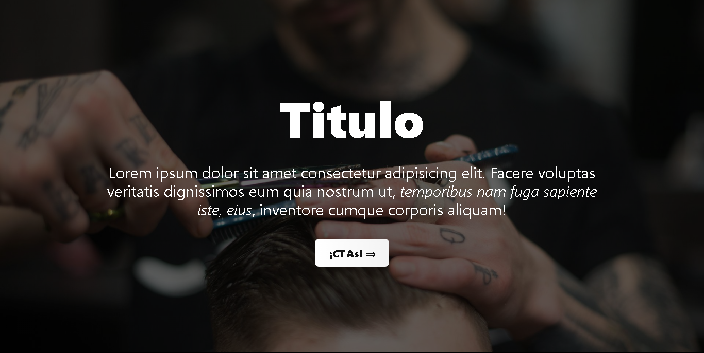

# Hero

Componente Hero para Svelte.

## Demo

Puedes ver una muestra de este hero en un proyecto real aquí 👉 [BarberHero](https://barberhero.netlify.app)

## Para usar

Copia el archivo `Hero.svelte` a tu proyecto y asegúrate de tener TailwindCSS configurado.

Actualmente el componente no recibe props, pero puedes modificar el título, descripción y enlace directamente en el archivo.

## Personalización

- Cambia la imagen de fondo editando la propiedad `background-image` en el bloque `<style>`.
- Modifica los textos y el enlace en el HTML.
- Ajusta los estilos usando clases de TailwindCSS.

## Requisitos

- [Svelte](https://svelte.dev/)
- [TailwindCSS](https://tailwindcss.com/)